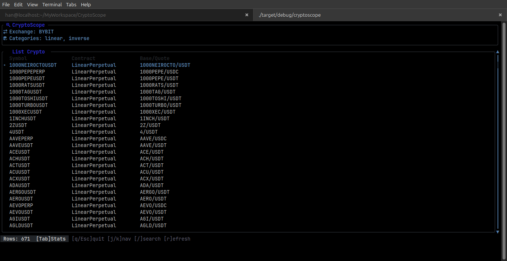

# CryptoScope 🔍

> Multi-exchange crypto symbols intelligence tool

Fetch and analyze perpetual/derivative symbols from crypto exchanges with a clean, modular TUI interface.

---

## Features

- ✅ Fetch all perpetual and derivative symbols from Exchange
- ✅ Support for both linear (USDT) and inverse categories
- ✅ Automatic pagination handling
- ✅ Filter by symbol name (case-insensitive search)
- ✅ Multiple output formats (text, JSON, interactive TUI)
- ✅ Modular architecture - easy to add new exchanges
- ✅ Fast execution (< 3 seconds for all symbols)
- ✅ Price Screener CLI** — Fetch and display symbols with price changes
- ✅ Database Caching** — Daily open prices cached in SQLite (once per day)
- ✅ Two Modes** — Ticker mode (fast) and K-line mode (accurate)
- ✅ Filtering** — Filter by min change %, min volume, symbol search, top N
- ✅ Color Output** — Green for gains, red for lossers

## Installation

```bash
# Clone and build
git clone https://github.com/HanSoBored/CryptoScope
cd CryptoScope
cargo build --release

# Or install directly
cargo install --path .
```

---

## Usage

### Basic Usage

```bash
# Launch interactive TUI (default: bybit, all categories)
cryptoscope

# Specify exchange
cryptoscope -e bybit
cryptoscope --exchange bybit

# Fetch only linear (USDT perpetual) symbols
cryptoscope --category linear

# Fetch only inverse perpetual symbols
cryptoscope --category inverse

# Combine exchange + category
cryptoscope -e bybit --category linear
```

### Screener Usage

```bash
# Run screener (default: kline mode, all categories)
cryptoscope screener

# Fast mode (ticker, rolling 24h price)
cryptoscope screener --mode ticker

# Accurate mode (k-line, true 00:00 UTC open)
cryptoscope screener --mode kline

# Specify exchange and category
cryptoscope screener -e bybit --category linear

# Show top 20 gainers/losers
cryptoscope screener --top 20

# Filter by minimum 5% change
cryptoscope screener --min-change 5

# Filter by specific symbol
cryptoscope screener --symbol BTC

# Force refresh cached data (clears stale cache)
cryptoscope screener --force-refresh

# Combined filters
cryptoscope screener --mode kline --top 50 --min-change 3 --min-volume 1000000
```

### Output Formats

```bash
# Interactive terminal UI (TUI)
cryptoscope

# Human-readable text output
cryptoscope --output text
# or use the convenience flag
cryptoscope --cli

# Machine-readable JSON output
cryptoscope --output json > symbols.json
```

**Note:** `--cli` is a shorthand for `--output text`. These flags conflict with each other.

### Filtering

```bash
# Search for symbols containing "BTC"
cryptoscope --search BTC

# Combine filters
cryptoscope --search ETH --category linear
```

### Other Options

```bash
# Enable verbose logging
cryptoscope --verbose

# See all available options
cryptoscope --help
```

### How It Works
1. **First Run:** Fetches daily open prices from Bybit API and caches in SQLite
2. **Subsequent Runs:** Uses cached open prices (auto-refreshes at 00:00 UTC)
3. **Current Prices:** Always fetched fresh from API
4. **Calculation:** `(current - open) / open * 100` for % change

### Database Location
- **Linux:** `~/.local/share/cryptoscope/data.db` or `~/cryptoscope/data.db`
- **macOS:** `~/Library/Application Support/cryptoscope/data.db`
- **Windows:** `%APPDATA%\cryptoscope\data.db`

---

## Example Output

### TUI Output



The TUI features:
- **Symbol table** - Scrollable list with selection highlighting
- **Stats dashboard** - Toggle with `Tab` or click header tabs to view statistics
- **Search** - Press `/` to filter symbols in real-time
- **Refresh** - Press `r` to re-fetch symbols from the API
- **Cyberpunk theme** - Dark UI with neon accent colors
- **Popup messages** - Status/error notifications auto-dismiss after 5 seconds (or press any key to dismiss immediately)

**Key bindings:**

| Key | Action |
|-----|--------|
| `q` / `Esc` | Quit |
| `j` / `↓` | Next symbol |
| `k` / `↑` | Previous symbol |
| `/` | Toggle search mode |
| `Tab` | Toggle symbol list / stats view |
| `r` | Refresh data |

**Mouse support:**
- Scroll wheel to navigate
- Click rows to select symbols
- Click scrollbar track to page up/down

### Screener Output

```
Symbol     |       Open |   Current |   Change % | Change Value | Volume 24h
-----------+------------+-----------+------------+--------------+-----------
BTCUSDT    |   84200.00 |  86500.00 |     +2.73% |      +2300.00 |    $1.52B
ETHUSDT    |    2450.00 |   2380.00 |     -2.86% |       -70.00 |    $890.45M
SOLUSDT    |     145.50 |    152.30 |     +4.67% |        +6.80 |    $456.12M
DOGEUSDT   |       0.15 |      0.14 |     -6.67% |       -0.01 |    $234.56M
```

> Colors: 🟢 Green = gains, 🔴 Red = losses (terminal-dependent)

### Text Output

```
=== CryptoScope: BYBIT Perpetual Symbols ===

Exchange: BYBIT
Categories: linear, inverse

📊 Statistics:
  Total Symbols: 669

  By Category:
    INVERSE (Inverse Perpetual): 27
    LINEAR (USDT Perpetual): 642

  By Contract Type:
    LinearPerpetual: 606
    LinearFutures: 36
    InversePerpetual: 23
    InverseFutures: 4

📋 Sample Symbols (first 20):
  0GUSDT, 1000000BABYDOGEUSDT, 1000000CHEEMSUSDT, ...
  ... and 649 more

✅ Fetch completed in 3.1s
```

---

### Adding a New Exchange

To add support for a new exchange (e.g., Binance):

1. Create `src/exchange/binance.rs`
2. Implement the `Exchange` trait
3. Add to the factory in `src/exchange/factory.rs`

That's it! No changes to existing code required.

### Troubleshooting
**Stale cache issues?** Run with `--force-refresh` to clear old data and fetch fresh open prices.

---

## Current Status

### Supported Exchanges

- ✅ Bybit V5 (linear + inverse perpetual/futures)

### Planned

- ⏳ Binance Futures
- ⏳ OKX Derivatives
- ⏳ Symbol comparison across exchanges

---

## License

GNU General Public License v3.0 (GPL-3.0)

## Contributing

Contributions welcome! Please feel free to submit a Pull Request.
